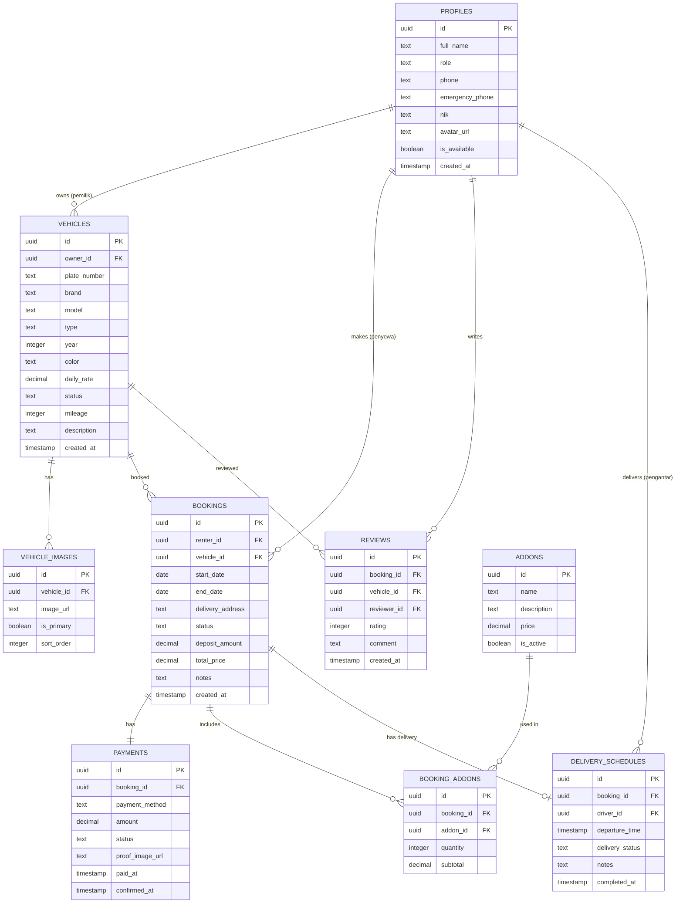

# Jebrent — Platform Rental Kendaraan 🚗

## Ringkasan Singkat

Platform web untuk bisnis rental kendaraan "Jebrent" — model **private marketplace** di mana satu brand Jebrent menampung beberapa **Pemilik** kendaraan sebagai provider. Penyewa bisa browse, booking, dan bayar lewat platform.

**Tech Stack:** Next.js (App Router) + Supabase + shadcn/ui + Tailwind CSS  
**Tim:** 2 orang  
**Scope MVP:** Auth → CRUD Kendaraan → Booking → Pembayaran → Pengantaran → Dashboard → Review

---

## 1. Evaluasi Class Diagram vs Kebutuhan Nyata

Berdasarkan [class diagram](file:///c:/Users/Pajar/Documents/CODE/NEXT%20JS/jebrent/DOKUMEN%20KELOMPOK/class%20diagram.jpg) yang sudah ada:

### ✅ Yang Sudah Bagus
| Class | Catatan |
|---|---|
| **Pengguna** (abstract) → Penyewa, Admin, Pemilik | Hierarki user sudah benar. Di Supabase, kita flatten jadi 1 tabel `profiles` dengan kolom `role` |
| **Kendaraan** | Atribut inti sudah cukup (plat_nomor, merk, harga_sewa, status) |
| **Pemesanan** | Field esensial ada (tgl_sewa, tgl_kembali, lokasi_antar, status, dp, total_biaya) |
| **Pembayaran** | Sudah ada metode_bayar, nominal, status_bayar |
| **LayananTambahan** | Sederhana dan cukup |
| **PengantarMobil + JadwalPengantaran** | Fitur antar kendaraan |

### ⚠️ Yang Perlu Disesuaikan

| Issue | Penjelasan | Solusi |
|---|---|---|
| **LogLokasiGPS** komposisi dari Kendaraan | Kita skip GPS tracking real-time. Tapi kita simpan struktur tabelnya untuk nanti | Buat tabel tapi **jangan build fitur**-nya dulu |
| **Method `cekJadwalPemeliharaan()`** | Fitur notifikasi perawatan di-skip | Tidak buat method ini |
| **Method `kirimPengingatH2()`** | Butuh integrasi WA/email | Skip, cukup tampilkan reminder di dashboard |
| **`cetakNotaDigital()`** | Bisa dibuat sebagai PDF download sederhana | Bisa fase 2 |
| **Review/Rating** tidak ada di class diagram | Tapi kamu pilih sebagai fitur MVP | **Perlu tambah class/tabel baru** |
| **Foto kendaraan** tidak ada di Kendaraan | Perlu multiple foto per kendaraan | **Perlu tambah tabel** `vehicle_images` |
| **Pengguna** tidak punya email | Di Supabase, auth pakai email. Perlu ditambah | Supabase `auth.users` handle ini |

> [!IMPORTANT]
> **Kesimpulan:** Class diagram sudah cukup baik untuk dokumen RPL. Untuk implementasi, kita perlu: (1) tambah Review/Rating, (2) tambah vehicle_images, (3) flatten hierarki user jadi single table dengan role enum, (4) manfaatkan Supabase auth.users sebagai pengganti atribut login di class Pengguna.

---

## 2. Database Schema untuk Supabase

### Penjelasan Konsep: Supabase = PostgreSQL + Auth + Storage

```
┌─────────────────────────────────────────────────┐
│                   SUPABASE                       │
│                                                  │
│  ┌──────────┐  ┌──────────┐  ┌───────────────┐  │
│  │   Auth   │  │ Database │  │   Storage     │  │
│  │  (Users) │  │ (Postgres)│  │ (File/Image) │  │
│  └────┬─────┘  └────┬─────┘  └───────────────┘  │
│       │              │                           │
│       │   profiles ──┘                           │
│       │   (linked via id)                        │
│       │                                          │
│  auth.users.id  ═══  profiles.id                 │
└─────────────────────────────────────────────────┘
```

> **Cara kerja:** Supabase punya built-in `auth.users` (email, password, dll). Kita buat tabel `profiles` yang **id-nya sama** dengan `auth.users.id`. Jadi waktu user register, otomatis row di `profiles` juga dibuat (via database trigger).

### Entity Relationship Diagram



### Mapping: Class Diagram → Database Tables

| Class Diagram | Database Table | Catatan |
|---|---|---|
| Pengguna (abstract) | `profiles` | Flatten semua subclass (Penyewa, Pemilik, Admin, PengantarMobil) jadi 1 tabel dengan `role` enum |
| Penyewa | `profiles` where role = 'renter' | Field: nik, full_name, phone, emergency_phone, avatar_url |
| Pemilik | `profiles` where role = 'owner' | Sama, ditambah relasi ke vehicles |
| Admin | `profiles` where role = 'admin' | Sama |
| PengantarMobil | `profiles` where role = 'driver' | Ditambah `is_available` boolean |
| Kendaraan | `vehicles` | Diperkaya: tambah model, year, color, type, description |
| — | `vehicle_images` | **[BARU]** Multi-foto per kendaraan |
| Pemesanan | `bookings` | Sama, field di-rename ke English |
| Pembayaran | `payments` | Ditambah `proof_image_url` untuk upload bukti |
| LayananTambahan | `addons` + `booking_addons` | Dipisah jadi master data + junction table |
| LogLokasiGPS | *(skip untuk MVP)* | Bisa ditambah nanti |
| PengantarMobil | `profiles` (role=driver) | — |
| JadwalPengantaran | `delivery_schedules` | — |
| — | `reviews` | **[BARU]** Fitur rating/review |

### SQL Schema (Supabase Migration)

Detail SQL akan digenerate saat eksekusi. Berikut highlights penting:

**Role Enum:**
```sql
CREATE TYPE user_role AS ENUM ('renter', 'owner', 'admin', 'driver');
```

**Booking Status Enum:**
```sql
CREATE TYPE booking_status AS ENUM (
  'pending',      -- Baru dibuat, menunggu konfirmasi pemilik
  'confirmed',    -- Dikonfirmasi pemilik
  'paid',         -- Sudah bayar (DP atau lunas)
  'in_delivery',  -- Sedang diantar
  'active',       -- Kendaraan sedang dipakai
  'returning',    -- Proses pengembalian
  'completed',    -- Selesai
  'cancelled'     -- Dibatalkan
);
```

**Vehicle Status Enum:**
```sql
CREATE TYPE vehicle_status AS ENUM (
  'available',    -- Tersedia untuk disewa
  'rented',       -- Sedang disewa
  'maintenance',  -- Sedang perawatan
  'inactive'      -- Tidak aktif/ditarik
);
```

**Payment Status Enum:**
```sql
CREATE TYPE payment_status AS ENUM (
  'unpaid',
  'pending_confirmation',  -- Bukti sudah diupload, menunggu konfirmasi
  'confirmed',
  'refunded'
);
```

**Row Level Security (RLS)** — Ini yang bikin Supabase powerful:
```
profiles  → User bisa read semua, tapi hanya edit profil sendiri
vehicles  → Semua bisa baca. Hanya owner & admin bisa CRUD
bookings  → Renter lihat booking sendiri. Owner lihat booking kendaraannya. Admin lihat semua
payments  → Sama seperti bookings
reviews   → Semua bisa baca. Hanya reviewer bisa buat/edit miliknya
```

---

## 3. Architecture: Layered Pattern di Next.js

### Konsep yang Kamu Tanya: "Kayak Flutter Layered Architecture?"

Di Flutter, kamu mungkin kenal pattern ini:

```
Flutter:
├── Presentation Layer  (Widgets, Screens)
├── Domain Layer         (Entities, Use Cases)
├── Data Layer           (Repositories, Data Sources)
```

Di Next.js + Supabase, equivalent-nya:

```
Next.js:
├── UI Layer             → React Components (page.tsx, components/)
├── Server Actions       → "Use Cases" / Business Logic (actions/)
├── Data Access Layer    → Supabase queries (lib/db/ atau services/)
├── Types/Models         → TypeScript types (types/)
```

### Penjelasan Tiap Layer

```
┌──────────────────────────────────────────────────────┐
│                    UI LAYER                           │
│  React Components (Client & Server Components)       │
│  • page.tsx, layout.tsx                               │
│  • components/ (reusable UI)                         │
│  👉 Ini = Flutter Widgets/Screens                    │
│  ❌ TIDAK boleh ada query database di sini           │
├──────────────────────────────────────────────────────┤
│                SERVER ACTIONS                         │
│  Functions yang handle business logic                │
│  • actions/booking.ts → createBooking(), cancelBook. │
│  • actions/vehicle.ts → createVehicle(), updateStatus│
│  👉 Ini = Flutter Use Cases                          │
│  ✅ Validasi, kalkulasi harga, cek permission        │
├──────────────────────────────────────────────────────┤
│                DATA ACCESS LAYER                      │
│  Direct Supabase queries                             │
│  • lib/db/vehicles.ts → getVehicles(), getById()     │
│  • lib/db/bookings.ts → insertBooking()              │
│  👉 Ini = Flutter Repository/Data Source             │
│  ✅ Hanya query. Tidak ada business logic            │
├──────────────────────────────────────────────────────┤
│                  TYPES                                │
│  TypeScript interfaces/types                         │
│  • types/database.ts → generated from Supabase       │
│  👉 Ini = Flutter Entities/Models                    │
│  ✅ Shared di semua layer                            │
└──────────────────────────────────────────────────────┘
```

> [!TIP]
> **Kenapa ini penting buat tim 2 orang?**
> 1. **Bisa kerja paralel** — Orang A bikin UI components, Orang B bikin server actions + data access
> 2. **Debugging lebih mudah** — Bug di kalkulasi harga? Cek `actions/`. Bug di query? Cek `lib/db/`. Bug di tampilan? Cek `components/`
> 3. **Gak jadi beban** — Karena Next.js App Router sudah naturally mendukung separation ini (Server Components = data fetching, Client Components = interactivity)

### Practical: Folder Structure

```
src/
├── app/                          # 🎯 Routes & Pages (UI Layer)
│   ├── (auth)/                   # Auth pages (grouped route)
│   │   ├── login/page.tsx
│   │   └── register/page.tsx
│   ├── (main)/                   # Main app pages
│   │   ├── layout.tsx            # Shared layout (navbar, sidebar)
│   │   ├── page.tsx              # Landing / Home
│   │   ├── vehicles/
│   │   │   ├── page.tsx          # Browse vehicles
│   │   │   └── [id]/page.tsx     # Vehicle detail
│   │   ├── bookings/
│   │   │   ├── page.tsx          # My bookings
│   │   │   └── [id]/page.tsx     # Booking detail
│   │   └── dashboard/
│   │       ├── page.tsx          # Redirect based on role
│   │       ├── admin/            # Admin dashboard pages
│   │       ├── owner/            # Owner dashboard pages
│   │       └── driver/           # Driver dashboard pages
│   ├── layout.tsx                # Root layout
│   └── globals.css
│
├── components/                   # 🧩 Reusable UI Components
│   ├── ui/                       # shadcn/ui components (auto-generated)
│   ├── vehicles/                 # Vehicle-specific components
│   │   ├── vehicle-card.tsx
│   │   ├── vehicle-filter.tsx
│   │   └── vehicle-form.tsx
│   ├── bookings/                 # Booking-specific components
│   │   ├── booking-form.tsx
│   │   ├── booking-status.tsx
│   │   └── booking-card.tsx
│   ├── layout/                   # Layout components
│   │   ├── navbar.tsx
│   │   ├── sidebar.tsx
│   │   └── footer.tsx
│   └── shared/                   # Shared components
│       ├── image-upload.tsx
│       └── date-range-picker.tsx
│
├── actions/                      # ⚡ Server Actions (Business Logic)
│   ├── auth.ts                   # register, login, updateProfile
│   ├── vehicles.ts               # CRUD kendaraan
│   ├── bookings.ts               # Create, cancel, complete booking
│   ├── payments.ts               # Upload proof, confirm payment
│   ├── reviews.ts                # CRUD review
│   └── delivery.ts               # Manage delivery schedules
│
├── lib/                          # 📚 Utilities & Data Access
│   ├── supabase/
│   │   ├── client.ts             # Browser Supabase client
│   │   ├── server.ts             # Server-side Supabase client
│   │   └── middleware.ts         # Auth middleware
│   ├── db/                       # Data Access Layer (queries)
│   │   ├── vehicles.ts
│   │   ├── bookings.ts
│   │   ├── payments.ts
│   │   ├── profiles.ts
│   │   └── reviews.ts
│   ├── utils.ts                  # Helper functions
│   └── constants.ts              # App-wide constants
│
├── types/                        # 📐 TypeScript Types
│   ├── database.ts               # Auto-generated from Supabase
│   ├── booking.ts                # Extended booking types
│   └── vehicle.ts                # Extended vehicle types
│
├── hooks/                        # 🪝 Custom React Hooks
│   ├── use-auth.ts
│   └── use-vehicles.ts
│
└── middleware.ts                  # Next.js middleware (route protection)
```

### Analogi dengan Dokumen RPL

```
Dokumen RPL                    →  Kode Kita
─────────────────────────────────────────────────
Class Diagram (classes)        →  types/ (TypeScript interfaces)
Class Diagram (methods)        →  actions/ (Server Actions)
Class Diagram (attributes)     →  Supabase schema (database tables)
Use Case Diagram               →  app/ routes + actions/
Activity Diagram               →  Booking flow dalam actions/bookings.ts
```

> [!NOTE]
> **Ini BUKAN over-engineering.** Di Next.js App Router, Server Components dan Server Actions **sudah memaksa** kamu memisahkan logic. Folder structure di atas cuma mengorganisasi apa yang sudah natural. Kalau kamu taruh semua di `page.tsx`, malah lebih susah di-maintain.

---

## 4. Apa yang Pattern Dokumen RPL Beri ke Development

Dokumen-dokumen RPL yang sudah kamu buat **bukan beban**, tapi jadi **peta** selama development:

| Dokumen | Manfaat untuk Dev |
|---|---|
| **SRS** | Jadi checklist fitur. Setiap requirement = 1 atau lebih task di Jira/Notion |
| **Class Diagram** | Langsung jadi panduan bikin database schema + TypeScript types |
| **Use Case Diagram** | Jadi panduan bikin routes & pages |
| **Activity Diagram** | Jadi panduan bikin flow di Server Actions |
| **PIECES Analysis** | Jadi panduan prioritas fitur — mana yang solve pain point terbesar |

---

## 5. Development Phases (Realistis untuk 2 Orang)

### Phase 1: Foundation (Minggu 1)
- [ ] Setup Supabase project + database schema
- [ ] Setup shadcn/ui properly
- [ ] Implement auth (register/login) dengan role-based access
- [ ] Buat base layout (navbar, sidebar, footer)
- [ ] Setup middleware untuk route protection

### Phase 2: Core — Kendaraan (Minggu 2)
- [ ] CRUD Kendaraan (form, listing, detail page)
- [ ] Upload foto kendaraan (Supabase Storage)
- [ ] Filter & search kendaraan
- [ ] Dashboard Pemilik: manage kendaraan sendiri

### Phase 3: Core — Booking & Pembayaran (Minggu 3)
- [ ] Booking flow (pilih tanggal → hitung harga → konfirmasi)
- [ ] Upload bukti pembayaran
- [ ] Konfirmasi pembayaran oleh owner/admin
- [ ] Status tracking (pending → confirmed → active → completed)

### Phase 4: Delivery & Dashboard (Minggu 4)
- [ ] Fitur pengantaran kendaraan
- [ ] Dashboard Admin (manage semua data)
- [ ] Dashboard Pemilik (pendapatan, statistik)

### Phase 5: Polish (Minggu 5)
- [ ] Review & Rating system
- [ ] Layanan tambahan (add-ons)
- [ ] Polish UI/UX
- [ ] Testing & bug fixing

### Pembagian Kerja Saran (2 orang)

| Developer A (Frontend-focused) | Developer B (Backend-focused) |
|---|---|
| Semua pages & components | Database schema & migrations |
| Form validations (client-side) | Server Actions & business logic |
| Dashboard layouts | RLS policies |
| Responsive design | Supabase Storage setup |
| shadcn/ui component integration | Auth flow & middleware |

---

## Open Questions

> [!IMPORTANT]
> **Q1: Deadline projek ini kapan?** Ini penting untuk menentukan seberapa banyak fitur yang realistis bisa di-build. Timeline 5 minggu di atas adalah estimasi ideal.

> [!IMPORTANT]
> **Q2: Bagaimana pricing model?** Apakah harga sewa per hari (daily_rate) saja, atau ada model lain (per jam, mingguan dengan diskon, dll)?

> [!IMPORTANT]
> **Q3: Apakah pemilik bisa set harga sendiri per kendaraan, atau harga ditentukan admin?** Ini mempengaruhi permission di RLS dan flow CRUD kendaraan.

> [!IMPORTANT]
> **Q4: Untuk fitur pengantaran, apakah ada biaya tambahan? Dan siapa yang assign pengantar ke booking — admin atau otomatis?** Ini mempengaruhi flow dan tabel yang perlu dibuat.

> [!IMPORTANT]
> **Q5: Apakah kamu sudah punya Supabase account?** Kalau belum, kita perlu buat dulu sebelum mulai setup.

---

## Verification Plan

### Setup Verification
- Supabase schema berhasil di-migrate tanpa error
- shadcn/ui components bisa dipakai di pages
- Auth flow (register → login → redirect) bekerja
- RLS policies ter-enforce (user biasa gak bisa akses data orang lain)

### Feature Verification
- Setiap phase di-verify dengan manual testing di browser
- Booking flow end-to-end: browse → pilih → booking → bayar → selesai

### Code Quality
- TypeScript strict mode, no `any`
- Consistent folder structure sesuai architecture pattern

---

## Proposed Next Steps

Setelah kamu approve plan ini dan jawab open questions:

1. **Setup Supabase** — Buat project, generate schema SQL, run migration
2. **Init shadcn/ui** — Install dan configure properly
3. **Scaffold folder structure** — Buat semua folder dan boilerplate files
4. **Mulai Phase 1** — Auth + Layout
