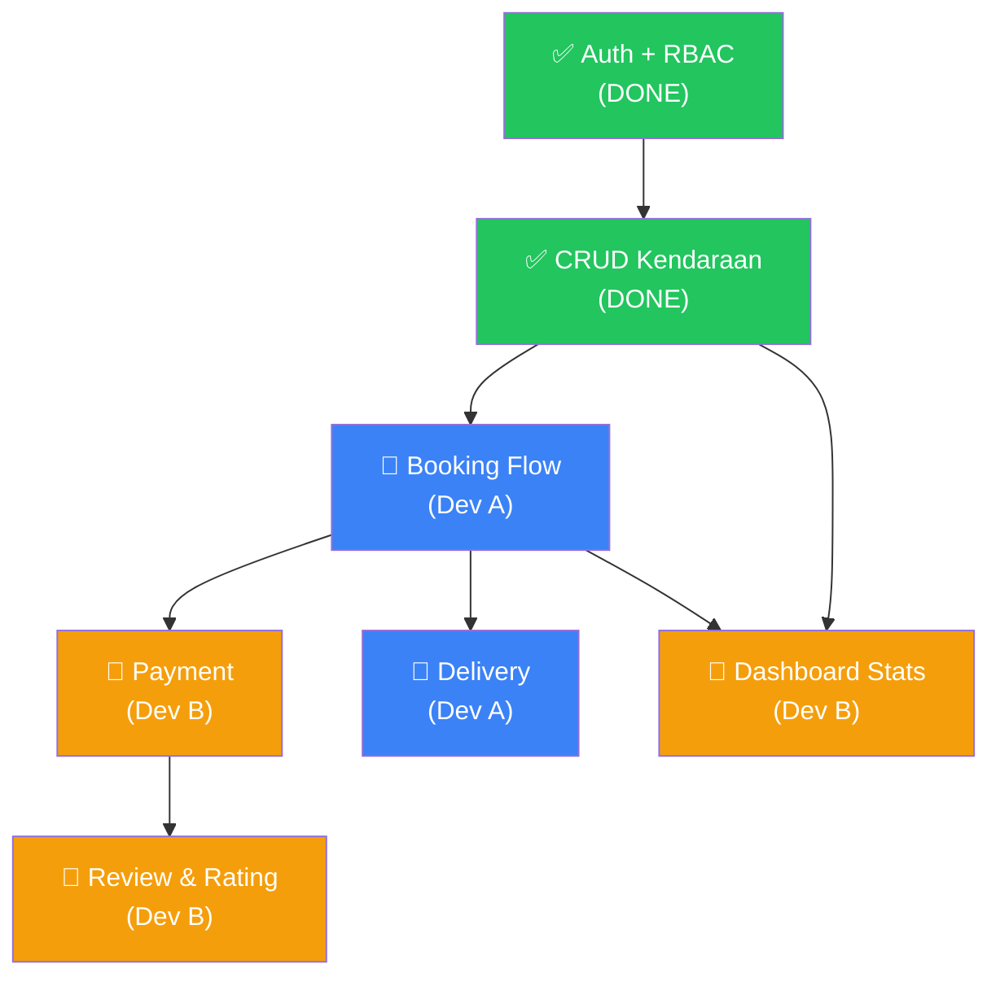

# 🚗 Jebrent — Pembagian Tugas 2 Developer

## Status Saat Ini (Sudah Selesai ✅)

| Fitur                       | Status  | File Utama                                         |
| --------------------------- | ------- | -------------------------------------------------- |
| Auth (Login/Register)       | ✅ Done | `actions/auth.ts`, `app/(auth)/`                   |
| RBAC Middleware             | ✅ Done | `middleware.ts`, `lib/auth-server.ts`              |
| CRUD Kendaraan (Owner)      | ✅ Done | `actions/vehicles.ts`, `lib/db/vehicles.ts`        |
| Upload Foto Kendaraan       | ✅ Done | `components/vehicles/image-upload.tsx`             |
| Browse Kendaraan (Public)   | ✅ Done | `app/(main)/vehicles/`                             |
| Dashboard Layout + Routing  | ✅ Done | `app/(main)/dashboard/`                            |
| Dashboard Placeholder Pages | ✅ Done | `dashboard/admin/`, `owner/`, `renter/`, `driver/` |
| Database Schema + RLS       | ✅ Done | `supabase/migrations/`                             |

## Fitur yang Masih Harus Dikerjakan 🔨

| Fitur                                                         | Prioritas | Estimasi     |
| ------------------------------------------------------------- | --------- | ------------ |
| **Booking Flow** (create, list, detail, cancel)               | 🔴 Tinggi | Besar        |
| **Payment** (upload bukti, konfirmasi)                        | 🔴 Tinggi | Sedang       |
| **Delivery/Pengantaran** (assign driver, status)              | 🟡 Sedang | Sedang       |
| **Review & Rating**                                           | 🟡 Sedang | Kecil-Sedang |
| **Dashboard Enhancement** (statistik nyata, bukan hardcode 0) | 🟡 Sedang | Sedang       |
| **Add-ons/Layanan Tambahan**                                  | 🟢 Rendah | Kecil        |
| **Polish UI/UX**                                              | 🟢 Rendah | Sedang       |

---

## 🧑‍💻 Pembagian: Dev A vs Dev B

### Prinsip Pembagian

- **Dev A**: Mengerjakan **Booking + Delivery** (flow penyewaan end-to-end)
- **Dev B**: Mengerjakan **Payment + Review + Dashboard Enhancement**
- Pembagian ini memastikan **TIDAK ADA file yang dikerjakan 2 orang bersamaan**

---

## Dev A — Booking & Delivery Flow

### Tanggung Jawab

Seluruh flow penyewa memesan kendaraan sampai kendaraan diantar.

### 📁 File/Folder Boundary (HANYA Dev A yang boleh edit)

```
src/
├── actions/
│   ├── bookings.ts              ← ✅ DONE (fully implemented)
│   └── delivery.ts              ← ✅ DONE (fully implemented)
│
├── lib/db/
│   ├── bookings.ts              ← ✅ DONE (fully implemented)
│   └── delivery.ts              ← ✅ DONE (new file, created)
│
├── app/(main)/
│   ├── bookings/
│   │   ├── page.tsx             ← 🔨 TODO (still placeholder)
│   │   └── [id]/
│   │       └── page.tsx         ← 🔨 TODO (still placeholder)
│   │
│   ├── vehicles/[id]/
│   │   └── booking/
│   │       └── page.tsx         ← ✅ DONE (booking page implemented)
│   │
│   └── dashboard/
│       ├── driver/
│       │   └── page.tsx         ← 🔨 TODO (enhance with delivery list)
│       └── driver/
│           └── deliveries/      ← 🔨 TODO (create folder + page)
│               └── page.tsx
│
├── components/
│   ├── bookings/
│   │   ├── booking-card.tsx     ← 🔨 TODO (still placeholder)
│   │   ├── booking-form.tsx     ← ✅ DONE (created, real-time price calc)
│   │   ├── booking-status.tsx   ← 🔨 TODO (create status badge/stepper)
│   │   └── booking-detail.tsx   ← 🔨 TODO (create detail view)
│   └── delivery/               ← 🔨 TODO (create entire folder)
│       ├── delivery-card.tsx
│       └── delivery-status.tsx
│
├── types/
│   └── booking.ts               ← ✅ DONE (created, extended types)
│
└── hooks/
    └── use-bookings.ts          ← 🔨 TODO (if needed for client state)
```

### Checklist Dev A

#### Booking — Server Actions (`actions/bookings.ts`)

- [x] `createBooking(vehicleId, startDate, endDate, deliveryAddress, notes)`
  - ✅ Validasi: tanggal tidak overlap dengan booking lain
  - ✅ Hitung `total_price` = `daily_rate × jumlah_hari` (+ weekly rate jika ≥7 hari)
  - ✅ Set status = `pending`
- [x] `cancelBooking(bookingId)` — hanya penyewa/admin
- [x] `confirmBooking(bookingId)` — hanya owner kendaraan/admin
- [x] `completeBooking(bookingId)` — mark sebagai selesai
- [x] `getMyBookings()` — list booking milik penyewa yang login
- [x] `getOwnerBookings()` — list booking untuk kendaraan milik owner
- [x] `calculatePriceBreakdown(vehicleId, start, end)` — _bonus_: helper kalkulasi harga untuk preview real-time di form

#### Booking — Data Access (`lib/db/bookings.ts`)

- [x] `insertBooking(data)` — insert ke tabel bookings
- [x] `getBookingById(id)` — join dengan vehicles, profiles, payments, delivery_schedules
- [x] `getBookingsByRenter(renterId)` — filter by renter_id
- [x] `getBookingsByVehicle(vehicleId)` — filter by vehicle_id
- [x] `getBookingsByOwner(ownerId)` — _bonus_: ambil semua booking kendaraan milik owner
- [x] `updateBookingStatus(id, status)`
- [x] `checkDateOverlap(vehicleId, startDate, endDate)` — cek konflik tanggal (hanya cek status aktif)
- [x] `countBookingsByRenter(renterId, status?)` — _bonus_: untuk dashboard stats

#### Booking — UI Pages

- [x] `bookings/page.tsx` — List booking user dengan filter status per tab
- [x] `bookings/[id]/page.tsx` — Detail booking dengan auth guard & permission check
- [x] `vehicles/[id]/booking/page.tsx` — Halaman booking per kendaraan (vehicle summary + BookingForm + auth guard)

> [!WARNING]
> **File `vehicles/[id]/page.tsx` adalah SHARED FILE** — Dev A hanya boleh **menambahkan tombol/link "Booking Sekarang"** di halaman ini. Jangan ubah struktur atau styling yang sudah ada. Koordinasikan dengan Dev B jika Dev B juga perlu edit file ini.

#### Booking — Components

- [x] `booking-form.tsx` — Form pilih tanggal, alamat antar, notes, kalkulasi harga real-time + weekly rate
- [x] `booking-card.tsx` — Card clickable untuk list booking (thumbnail, status badge, tanggal, harga)
- [x] `booking-status.tsx` — `BookingStatusBadge` (compact) + `BookingStatusStepper` (timeline visual)
- [x] `booking-detail.tsx` — Full detail view dengan action buttons berbasis role (cancel/confirm/complete)

#### Delivery — Server Actions (`actions/delivery.ts`)

- [x] `assignDriver(bookingId, driverId)` — assign pengantar ke booking (hanya admin/owner)
- [x] `updateDeliveryStatus(deliveryId, status)` — update status pengantaran (otomatis update booking status ke `active` saat `delivered`)
- [x] `getDriverDeliveries()` — list jadwal untuk driver yang login

#### Delivery — Data Access (`lib/db/delivery.ts`) ← NEW FILE ✅ CREATED

- [x] `insertDeliverySchedule(data)`
- [x] `getDeliveryByBooking(bookingId)`
- [x] `getDeliveriesByDriver(driverId)`
- [x] `updateDeliveryStatus(id, status)` — otomatis set `completed_at` saat status = `completed`

#### Delivery — UI

- [x] Update `dashboard/driver/page.tsx` — real stats (hari ini/aktif/selesai) + list DeliveryCard aktif
- [x] `dashboard/driver/deliveries/page.tsx` — halaman semua deliveries dengan filter status

#### Delivery — Components

- [x] `delivery-card.tsx` — Card interaktif dengan tombol update status (mulai antar → terkirim → selesai)
- [x] `delivery-status.tsx` — `DeliveryStatusBadge` badge status pengantaran

---

> [!NOTE]
> **Progress Dev A sampai 2026-06-17 (Final):**
>
> - Semua layer backend & UI Booking + Delivery sudah selesai ✅
> - Bug fix: normalisasi Supabase array response di `booking-detail.tsx` ✅
> - `dashboard/owner/bookings/page.tsx` — halaman owner untuk melihat & konfirmasi/tolak pesanan masuk ✅
> - `dashboard/owner/page.tsx` — enhanced dengan stats pesanan aktif + alert pending bookings ✅
> - `dashboard/renter/page.tsx` — enhanced dengan real stats + list 3 booking terbaru ✅
> - `dashboard/renter/bookings/page.tsx` — redirect ke `/bookings` ✅
> - **Semua Booking & Delivery Flow SELESAI** — siap merge ke `feature-booking-flow`

---

## Dev B — Payment, Review & Dashboard

### Tanggung Jawab

Pembayaran setelah booking dikonfirmasi, review setelah booking selesai, dan dashboard statistik yang real (bukan hardcode).

### 📁 File/Folder Boundary (HANYA Dev B yang boleh edit)

```
src/
├── actions/
│   ├── payments.ts              ← 🔨 Implement (currently TODO)
│   └── reviews.ts               ← 🔨 Implement (currently TODO)
│
├── lib/db/
│   ├── payments.ts              ← 🔨 Implement (currently TODO)
│   └── reviews.ts               ← 🔨 Implement (currently TODO)
│
├── app/(main)/
│   └── dashboard/
│       ├── admin/
│       │   ├── page.tsx         ← 🔨 Enhance (real stats, manage all)
│       │   ├── bookings/        ← 🆕 Create folder
│       │   │   └── page.tsx     (admin lihat semua booking)
│       │   ├── payments/        ← 🆕 Create folder
│       │   │   └── page.tsx     (konfirmasi pembayaran)
│       │   └── users/           ← 🆕 Create folder
│       │       └── page.tsx     (manage users)
│       ├── owner/
│       │   ├── page.tsx         ← 🔨 Enhance (real stats, pendapatan)
│       │   └── bookings/        ← 🆕 Create folder
│       │       └── page.tsx     (booking masuk ke kendaraan owner)
│       └── renter/
│           └── page.tsx         ← 🔨 Enhance (real stats booking)
│
├── components/
│   ├── payments/                ← 🆕 Create entire folder
│   │   ├── payment-form.tsx     (upload bukti bayar)
│   │   ├── payment-status.tsx   (badge status pembayaran)
│   │   └── payment-confirm.tsx  (tombol konfirmasi untuk admin/owner)
│   ├── reviews/                 ← 🆕 Create entire folder
│   │   ├── review-form.tsx      (form rating + komentar)
│   │   ├── review-card.tsx      (tampilan 1 review)
│   │   └── review-list.tsx      (list review per kendaraan)
│   └── dashboard/               ← 🆕 Create entire folder
│       ├── stat-card.tsx        (reusable stat card component)
│       ├── revenue-chart.tsx    (chart pendapatan, jika sempat)
│       └── recent-bookings.tsx  (table booking terbaru)
│
├── types/
│   ├── payment.ts               ← 🆕 Create
│   └── review.ts                ← 🆕 Create
│
└── hooks/
    └── use-payments.ts          ← 🆕 Create (if needed)
```

### Checklist Dev B

#### Payment — Server Actions (`actions/payments.ts`)

- [ ] `uploadPaymentProof(bookingId, proofFile)` — upload bukti ke Supabase Storage
- [ ] `confirmPayment(paymentId)` — admin/owner konfirmasi, status → `confirmed`
- [ ] `getPaymentByBooking(bookingId)` — get payment info
- [ ] `refundPayment(paymentId)` — set status → `refunded` (jika dibatalkan)

#### Payment — Data Access (`lib/db/payments.ts`)

- [ ] `insertPayment(data)` — insert payment record
- [ ] `getPaymentById(id)`
- [ ] `getPaymentByBookingId(bookingId)`
- [ ] `getPendingPayments()` — untuk admin: list yang perlu dikonfirmasi
- [ ] `updatePaymentStatus(id, status, confirmedAt?)`

#### Payment — Components

- [ ] `payment-form.tsx` — Upload bukti bayar (mirip image-upload tapi untuk payment proof)
- [ ] `payment-status.tsx` — Badge: unpaid → pending_confirmation → confirmed
- [ ] `payment-confirm.tsx` — Tombol & modal untuk admin/owner konfirmasi

#### Review — Server Actions (`actions/reviews.ts`)

- [ ] `createReview(bookingId, vehicleId, rating, comment)` — hanya reviewer
- [ ] `updateReview(reviewId, rating, comment)`
- [ ] `deleteReview(reviewId)`
- [ ] `getVehicleReviews(vehicleId)` — list review untuk 1 kendaraan

#### Review — Data Access (`lib/db/reviews.ts`)

- [ ] `insertReview(data)`
- [ ] `getReviewsByVehicle(vehicleId)` — join dengan profiles untuk nama reviewer
- [ ] `getReviewByBooking(bookingId)` — cek apakah sudah review
- [ ] `updateReview(id, data)`
- [ ] `deleteReview(id)`
- [ ] `getAverageRating(vehicleId)` — hitung rata-rata rating

#### Review — Components

- [ ] `review-form.tsx` — Form rating (1-5 bintang) + textarea komentar
- [ ] `review-card.tsx` — Display 1 review (nama, rating stars, komentar, tanggal)
- [ ] `review-list.tsx` — List semua review per kendaraan + average rating

#### Dashboard Enhancements

- [ ] `dashboard/admin/page.tsx` — Tampilkan real stats:
  - Total users, total kendaraan, total booking, total pendapatan
  - Table booking terbaru
  - Link ke sub-pages (manage bookings, payments, users)
- [ ] `dashboard/owner/page.tsx` — Tampilkan real stats:
  - Total kendaraan owner, total booking masuk, pendapatan bulan ini
  - Table booking terbaru untuk kendaraan mereka
- [ ] `dashboard/renter/page.tsx` — Tampilkan real stats:
  - Total booking, booking aktif (dari database, bukan hardcode 0)

#### Dashboard Sub-Pages (Admin)

- [ ] `admin/bookings/page.tsx` — Admin lihat & manage semua booking
- [ ] `admin/payments/page.tsx` — Admin konfirmasi pembayaran masuk
- [ ] `admin/users/page.tsx` — Admin lihat & manage users

---

## ⚠️ SHARED FILES — Zona Rawan Konflik

File-file ini **mungkin perlu diedit oleh kedua developer**. Atur agar TIDAK dikerjakan bersamaan:

| File                                | Dev A boleh edit                           | Dev B boleh edit                             | Cara handle                                             |
| ----------------------------------- | ------------------------------------------ | -------------------------------------------- | ------------------------------------------------------- |
| `app/(main)/vehicles/[id]/page.tsx` | Tambah tombol "Booking"                    | Tambah section "Reviews"                     | **Dev A duluan**, Dev B merge setelahnya                |
| `app/(main)/dashboard/layout.tsx`   | Tambah link "Deliveries" di sidebar driver | Tambah link sub-pages di sidebar admin/owner | **Buat di branch masing-masing**, merge satu per satu   |
| `types/database.ts`                 | Tambah type booking/delivery               | Tambah type payment/review                   | **Regenerate bareng** dari Supabase, jangan edit manual |
| `supabase/migrations/*`             | Migration baru untuk delivery              | Migration baru untuk payment/review          | **Beda file migration**, pakai timestamp berbeda        |
| `middleware.ts`                     | Mungkin perlu update route protection      | Mungkin perlu update route protection        | **Koordinasikan chat dulu**                             |
| `globals.css`                       | ❌ Jangan edit                             | ❌ Jangan edit                               | Sudah stabil, jangan diubah kecuali terpaksa            |
| `app/(main)/layout.tsx`             | ❌ Jangan edit                             | ❌ Jangan edit                               | Sudah stabil                                            |

---

## 🌿 Strategi Git Branching

### Workflow yang Direkomendasikan

```
main (stable)
  │
  ├── feature/booking-flow        ← Dev A
  │     Semua commit booking + delivery di sini
  │
  └── feature/payment-review      ← Dev B
        Semua commit payment + review + dashboard di sini
```

### Rules

1. **JANGAN push langsung ke `main`** — selalu lewat branch
2. **Dev A buat branch:**
   ```bash
   git checkout -b feature/booking-flow
   ```
3. **Dev B buat branch:**
   ```bash
   git checkout -b feature/payment-review
   ```
4. **Sebelum mulai kerja setiap hari:**
   ```bash
   git pull origin main
   git merge main          # merge main terbaru ke branch kamu
   ```
5. **Kalau sudah selesai 1 fitur utama**, buat Pull Request ke `main`
6. **Urutan merge yang aman:**
   - Dev A merge `feature/booking-flow` ke `main` **duluan** (karena payment tergantung booking)
   - Dev B pull main terbaru, resolve konflik jika ada, lalu merge `feature/payment-review`

### Kapan Boleh Commit ke Main Langsung?

- Typo fix kecil
- Update README
- File konfigurasi yang tidak berkaitan (`.env.example`, dll)

---

## 📅 Timeline Saran

### Minggu Ini (Dev A & Dev B paralel)

| Hari | Dev A (Booking + Delivery)                     | Dev B (Payment + Review + Dashboard)         |
| ---- | ---------------------------------------------- | -------------------------------------------- |
| 1-2  | `lib/db/bookings.ts` + `actions/bookings.ts`   | `lib/db/payments.ts` + `actions/payments.ts` |
| 3    | `booking-form.tsx` + `booking-card.tsx`        | `payment-form.tsx` + `payment-status.tsx`    |
| 4    | `bookings/page.tsx` + `bookings/[id]/page.tsx` | `lib/db/reviews.ts` + `actions/reviews.ts`   |
| 5    | `delivery.ts` actions + DB                     | `review-form.tsx` + `review-card.tsx`        |
| 6    | Driver dashboard + delivery UI                 | Dashboard admin/owner/renter enhancements    |
| 7    | Testing + bug fix                              | Testing + bug fix                            |

### Minggu Berikutnya (Integrasi)

- **Merge Dev A ke main** → Test booking flow end-to-end
- **Merge Dev B ke main** → Test payment + review
- **Bersama**: Polish UI, fix bugs, integrasi antar fitur

---

## 📋 Dependency Diagram



> [!IMPORTANT]
> **Payment butuh Booking sudah jadi duluan** — Dev B bisa mulai dari Review + Dashboard enhancement dulu sambil menunggu Dev A selesai booking flow. Atau Dev B bisa buat payment logic dengan mock data / hardcoded bookingId dulu.

> [!TIP]
> **Kalau Dev B mau mulai Payment tanpa nunggu Dev A:** Buat 1 booking manual di Supabase dashboard (insert langsung ke tabel `bookings`), lalu kembangkan payment flow berdasarkan booking ID itu. Nanti tinggal konek setelah Dev A selesai.
